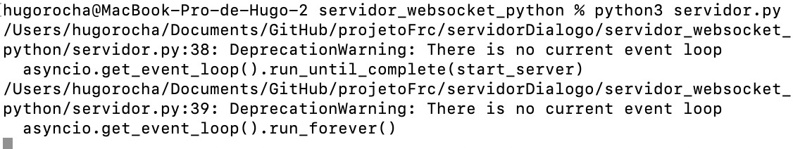
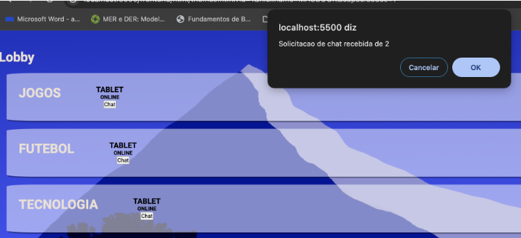
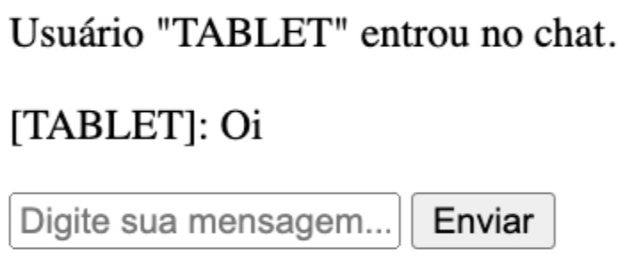
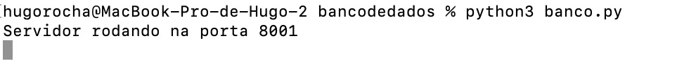

# Solução implementada

A solução implementada utiliza-se de um servidor WebSocket implementado em Python. Grosso modo, toda a comunicação da solulçao perpassa por este servidor, de maneiras sutis ou não. A biblioteca escolhida para esta aplicação foi a biblioteca `websockets`.

## Descrição da solução

O servidor em si possui uma implementação relativamente simples. Contudo, esta implementação simples é consumida de forma a gerenciar toda a arquitetura principal da aplicação via JavaScript.

## Servidor WebSocket

O servidor pode ser descrito a partir de uma única classe `ChatServer()`. Esta classe possui as funções `handle_message` e `handle_consumer`. Suas funcionalidades estão descritas abaixo.

- **handle_message**: Simplesmente verifica se o cliente não é o próprio servidos WebSocket e espera pela mensagem;
- **handle_consumer**: recebe um caminho (**path**) que deve ser algo como "canal1", "canal2", etc. Não havendo um canal dentro do servidor, ele é configurado. Então, enquanto necessário, utiliza-se de `handle_message`para lidar com as mensagens e depois fecha o canal.

O Websocket rodando está representado na figura 1.

Figura 1 - Websocket rodando

### Uso do servidor WebSocket

O servidor websocket implementado é utilizado de maneiras interessantes durante a execução da aplicação. As descrições do funcionamento estão disponíveis abaixo.

#### Lobby

O lobby da aplicação utiliza-se do servidor WebSocket de modo a verificar quem está oline a fim de permitir a comunicação com os outros usuários. O código JavaScript dedicado a esta página possui uma gama de funções que utilizam-se do servidor websocket e do banco de dados para constantemente retribuir os status dos usuários e assim poder renderizar (ou não) os ícones adequados.

O lobby caracteriza-se por mostrar todos os usuários cadastrados e, por meio de requisições constantes ao WebSocket, garante quem está ou não online. O lobby sem usuaŕios online e com usuários online está representado nas figuras 2 e 3.

Figura 2 - Lobby com nenhum usuário online

Figura 3 - Lobby com usuário online que só pode se comunicar via chat

#### Chamada de vídeo

O chat de vídeo conecta-se ao WebSocket e ao banco de dados. Qquando o WebSocket recebe uma mensagem, ele verifica se há peers e se há uma ação para realizar. Se a ação for `new-peer`, cria um offerer WebRTC e, se for `new-offer`, um answerer WebRTC. Ainda, se for `new-answer`, envia uma mensagem a um peer.

A criação de offerers e answerers é feita a partir de funções que utlizam-se do WebRTC, e a troca de mensagens se baseia na alteração destas ações e compressão em JSON.

O chat de texto é mostrado funcionando nas figuras 4 e 5

Figura 4 - Lobby com solicitação de conexão

Figura 5 - Chat de texto

## Banco de dados

O banco de dados da aplicação é um SQlite3 implementado também a partir de código Python. As funções deste banco estão definidas abaixo:

- **criar_tabela_USERS**: Cria uma tabela USERS se inexistente com as colunas _id, nickname, password, themes, capacidades_ e um constraint *USERS_UK*;
- **criar_tabela_THEMES**: Cria uma tabela THEMES se inexistente com as colunas _id, name, description_ e a constraint *THEMES_UK*;
- **RequestHandler**: Recebe as requisições HTTP e lida com elas de acordo, criando caminhos para a obtenção de resultados de queries específicas.

O banco de dados em execução está representado na figura 4.

